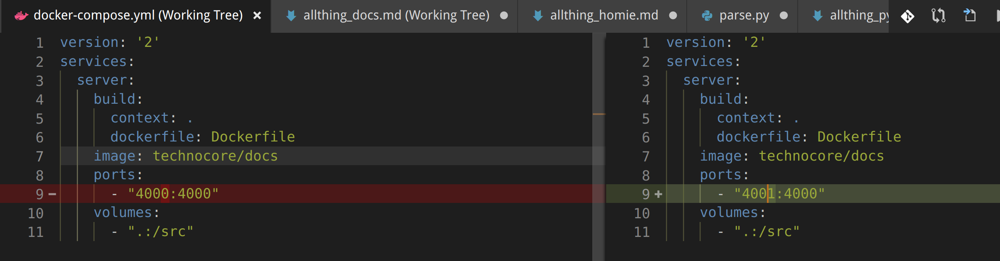

## How to run Jekyll without the whole TechnoCore
1. You'll need Docker as well as Docker-Compose
Fedora Docker install instructions: taken from [Docker documentation](https://docs.docker.com/install/linux/docker-ce/fedora/)
```
sudo dnf -y install dnf-plugins-core
sudo dnf config-manager \
    --add-repo \
    https://download.docker.com/linux/fedora/docker-ce.repo
sudo dnf install docker-ce docker-compose
```
2. Clone the Docs repo
```
git clone git@github.com:SciFiFarms/TechnoCore-Docs.git docs
cd docs
```
3. Create Docker image
At some point, this step shouldn't be needed. 
```
docker build . -t technocore/docs:local
```
4. Start the Jekyll service
```
docker-compose up
```
5. View documentation
Visit http://localhost:4000
### Troubleshooting
If you get an error in step 4 that looks like this:
```
Error starting userland proxy: listen tcp 0.0.0.0:4000: bind: address already in use'
```
You're likely already running a docs container. You can run another container by changing the port in the docker-compose to an unused port. 

You'll need to change the URL you visit similarly: http://localhost:4001

Live reload a page once it has been updated is supposed to be possible, but doesn't seem to work out of the box. 


### Docs Like Code
https://www.docslikecode.com

### Examples of community files:
https://blog.digitalocean.com/documentation-as-an-open-source-practice

### How to run Docs without the rest of the TechnoCore:

### Static site boilerplate
https://github.com/ericalli/static-site-boilerplate

### Create an issues template for doc issues:
http://www.docslikecode.com/articles/doc-issues-tracking/


### To add a page: 
1. Add page reference in _data/topnav.yml (Optional)
2. Add page reference in _data/sidebars/name_sidebar.yml
3. Create page in the sidebar's folder in pages/

### Great overview of how to scale with Jekyll
https://www.smashingmagazine.com/2016/08/using-a-static-site-generator-at-scale-lessons-learned/

### Embeddable Markdown editor (open source): 
[prose.io](http://prose.io)
[Pando](https://github.com/pandao/editor.md)

### Jekyll-Reload gem to reload page... Should already be working, but is not.
[Jekyll-Reload](https://www.rubydoc.info/gems/jekyll-reload/)

### Docs Like Code PR checklist:
https://gallery.mailchimp.com/3828f8d87d82289b96ff8fd19/files/docs_review_checklist.pdf

### Homepage: jekyllrb.com

### Cheatsheet:
learn.cloudcannon.com/jekyll-cheat-sheet

### Basic usage:
jekyllrb.com/docs/usage

### Using livereload:
rubydoc.info/gems/jekyll-reload

### Docker image:
github.com/envygeeks/jekyll-docker

### How posts work
https://jekyllrb.com/docs/posts/

### Dynamic menus in Jekyll
https://thinkshout.com/blog/2014/12/creating-dynamic-menus-in-jekyll/

### How linking in Jekyll works
https://www.digitalocean.com/community/tutorials/controlling-urls-and-links-in-jekyll

### Pages on what formatting to use
http://ericholscher.com/blog/2016/mar/15/dont-use-markdown-for-technical-docs/
https://asciidoctor.org/docs/what-is-asciidoc/
http://www.sphinx-doc.org/en/stable/
https://www.makeuseof.com/tag/compare-markup-language-asciidoc-markdown/
https://news.ycombinator.com/item?id=11922485

### Markdown editors
https://itsfoss.com/best-markdown-editors-linux/
https://remarkableapp.github.io/linux.html

### Jekyll Themes
https://github.com/jekyll/jekyll/wiki/Themes
https://jekyllrb.com/docs/themes/
http://jekyllthemes.org/
https://jekyllthemes.io/

### Some information about configuration and themes
https://www.taniarascia.com/make-a-static-website-with-jekyll/

### Original repo
https://github.com/tomjoht/documentation-theme-jekyll

### Hosting Jekyll on Github with SSL
https://hackernoon.com/how-to-setup-your-jekyll-website-with-free-web-hosting-ssl-and-a-custom-domain-4056ff862ca1
https://programminghistorian.org/en/lessons/building-static-sites-with-jekyll-github-pages
https://help.github.com/articles/configuring-jekyll/

### Markdown to PDF with make and makefile
https://blog.scottlowe.org/2018/09/27/a-markdown-to-pdf-workflow-on-linux/

### TiddlyWiki seems like a nice alternative to Jekyll. At least for personal use.
https://tiddlywiki.com/
https://tiddlywiki.com/static/TiddlerFiles.html
https://tiddlywiki.com/static/TiddlyWikiFolders.html
https://tiddlywiki.com/plugins/tiddlywiki/markdown/
https://tiddlywiki.com/static/How%2520to%2520build%2520a%2520TiddlyWiki5%2520from%2520individual%2520tiddlers.html
https://tiddlywiki.com/static/Using%2520TiddlyWiki%2520for%2520GitHub%2520project%2520documentation.html
https://tiddlywiki.com/static/Generating%2520Static%2520Sites%2520with%2520TiddlyWiki.html




